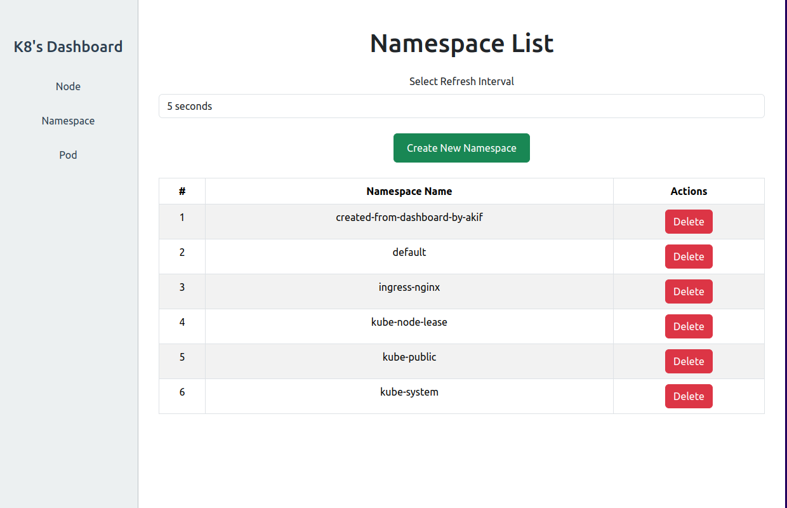

# Kubernetes Dashboard Project



## Overview

  

This is a 2 tier project built with **Go** and **React**, designed to **interact with Kubernetes clusters**. It allows users to perform CRUD operations on Kubernetes resources, including Pods, Namespaces, Nodes.
## Prerequisites
- have kubernetes cluster running
- have kubernetes config file added to your context
- have ingress enabled in your cluster [here](https://github.com/kubernetes/ingress-nginx/tree/main/charts/ingress-nginx)
## how to use?
- clone
```
git clone https://github.com/aakkiiff/kubernetes-dashboard-project.git

cd kubernetes-dashboard-project/
```

- build and push the frontend  docker image
```
cd frontend
docker build -t image_name .
docker push image_name

```

- build and push the backend  docker image
```
cd backend
docker build -t image_name .
docker push image_name
```

- update the image name from the frontend and backend manifest file
```
cd k8s/
vim frontend.yaml 
vim backend.yaml 
```
- **have a kubernetes cluster running**
- apply the manifest files in your cluster
```
kubectl apply -f k8s/
```
## verify
- get the exposed ingress ip address
```
kubectl get ingress
```
- now browse and enjoy!